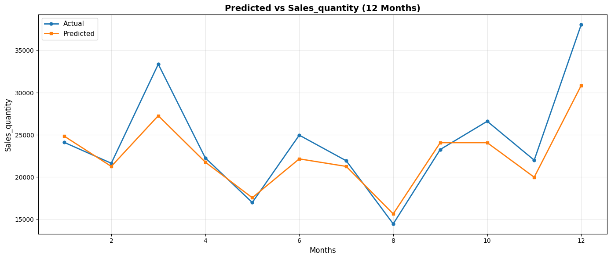

# Sale Forecasting with TimesFM

Forecasting monthly sales using Google's **TimesFM** model.

## Project Overview

This project demonstrates a zero/few-shot time-series forecasting for monthly sales data:

- Loads and cleans a monthly sales dataset.
- Forecasts the next 12 months with `google/timesfm-2.0-500m-pytorch`.
- Compares forecasted values with actual values from a held-out period.
- Visualizes `Actual vs Predicted` for quick evaluation.



## TimeFM model details:
You will find the information of the model here: (Google TimesFM)[https://research.google/blog/a-decoder-only-foundation-model-for-time-series-forecasting/]

Hugging Face documentation: (Hugging Face)[https://huggingface.co/docs/transformers/en/model_doc/timesfm]


## Repository Contents

- `timesfm_v2.ipynb` - Main notebook containing data prep, model inference, and plotting.
- `sales_quantity.png` - Forecast visualization output.

## Dataset Requirements

The notebook expects a CSV file containing at least:

- `Period` (date-like column)
- `Sales_quantity` (numeric target column)

Note: the current notebook loads data from `/content/Month_Value_1.csv` (Google Colab path). If running locally, update this path to your local file location.

## Method Summary

1. Read CSV and parse `Period` as datetime.
2. Drop missing rows.
3. Keep data before `2020-01-01`.
4. Split data:
   - Inference context: before `2019-01-01`
   - Evaluation window: from `2019-01-01` onward
5. Load TimesFM model via Hugging Face Transformers.
6. Forecast and compare first 12 predicted points against actual values.
7. Plot results.

## Environment Setup

Use Python 3.10+ (3.11 recommended).

Install dependencies:

```bash
pip install torch transformers pandas numpy matplotlib jupyter
```

Optional: use GPU for faster inference.

## How to Run

1. Place `Month_Value_1.csv` in your working directory (or update path in notebook).
2. Open the notebook:

```bash
jupyter notebook timesfm_v2.ipynb
```

3. Run all cells in order.
4. Review numeric forecast output and the final comparison plot.